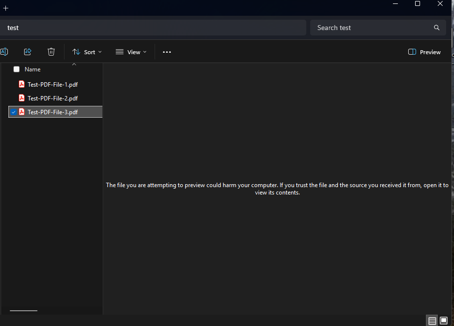
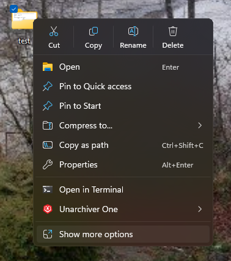
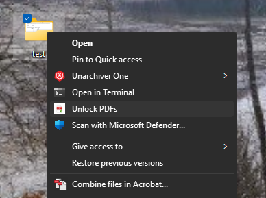
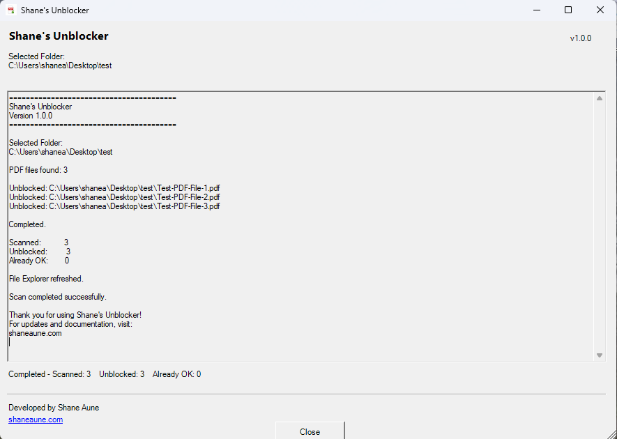
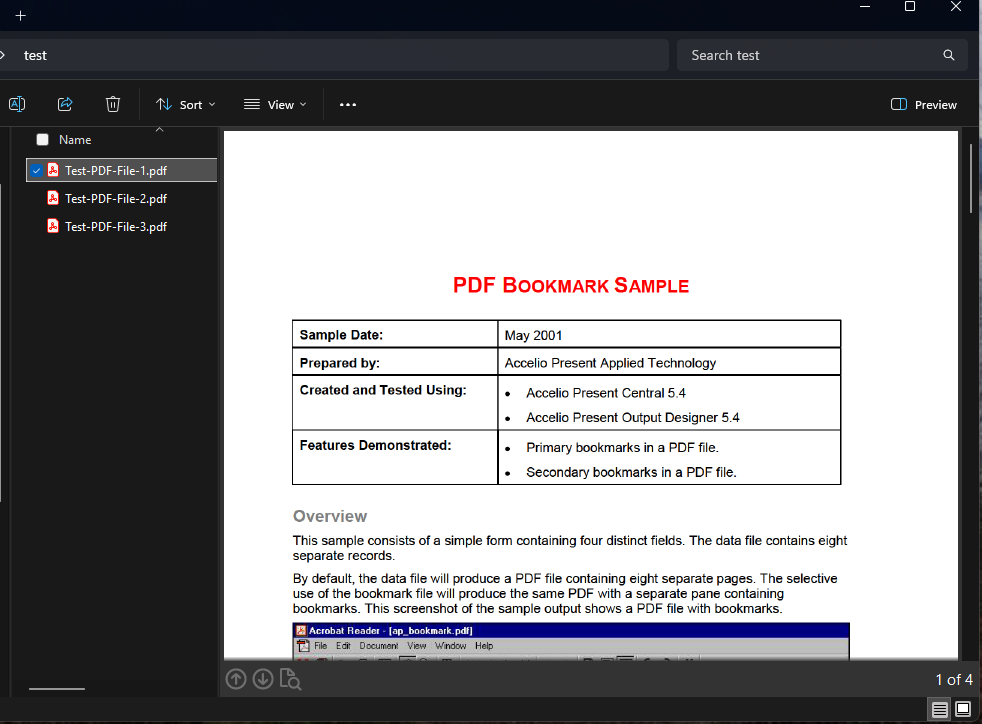

# Shane's Unblocker

A simple Windows utility that restores PDF previews in File Explorer by removing the **Mark of the Web** from blocked PDF files.

**Current Version:** 1.1.0

**Project Webpage:**  
https://www.shaneaune.com/my-projects/Shanes-Unblocker/

---

## Download

The latest version of Shane's Unblocker can always be downloaded from the Releases page.

https://github.com/shaneaune/Shanes-Unblocker/releases/latest

Download the ZIP file attached to the latest release.

---

## Why was this created?

Microsoft introduced a security update for Windows 10 and Windows 11 that prevents File Explorer from previewing many PDF files downloaded from the Internet.

Instead of displaying the preview, File Explorer shows:

> "The file you are attempting to preview could harm your computer. If you trust the file and the source you received it from, open it to view its contents."

While Windows includes the `Unblock-File` PowerShell command, many users are unfamiliar with PowerShell or need to unblock hundreds or even thousands of PDF files.

**Shane's Unblocker** provides a simple right-click solution that removes the Windows **Mark of the Web** from blocked PDF files, restoring PDF previews without requiring PowerShell knowledge.

If you find this project useful, I'd love to hear from you.

---

# Screenshots

## Blocked PDF Preview

Before unlocking, File Explorer displays the following message instead of a preview.



---

## Windows 11

On Windows 11, right click on the folder and select **Show more options**.



---

## Unlock PDFs

Right-click the folder containing your PDF files and select **Unlock PDFs**.



---

## Progress Window

The program displays live progress while scanning.



---

## Preview Restored

Once the PDFs have been unlocked, previews work normally again.



---

# Installation

1. Extract the ZIP file.

2. Copy the **Shanes-Unblocker** folder to a permanent location.

Recommended:

```text
C:\Shanes-Unblocker
```

You may also use another permanent location, such as:

```text
C:\Program Files\Shanes-Unblocker
```

3. Do **not** move or rename the folder after installation.

If you do, simply run **Uninstall.bat**, move the folder, then run **Install.bat** again.

4. Double-click **Install.bat**.

Windows 10 users may see a Windows Defender SmartScreen warning. Select:

**More info → Run anyway**

5. Right-click any folder containing PDF files.

6. Windows 11 users:

Select **Show more options**.

7. Select **Unlock PDFs**.

The program will automatically scan the selected folder and all subfolders.

---

# Features

- Adds an **Unlock PDFs** option to the Windows Explorer context menu.
- Recursively scans the selected folder and all subfolders.
- Can scan an entire drive (large drives may take longer).
- Unlocks only PDF files that are actually blocked.
- Displays a live scrolling progress log.
- Displays a completion summary.
- Automatically refreshes File Explorer when the scan completes.
- Installs for the current user only.
- Does not require Administrator privileges.

---

# Notes

After unlocking PDFs, File Explorer may not refresh the preview pane immediately.

If the security message still appears:

- Click another file.
- Press **F5**.
- Close and reopen the folder.

---

# Uninstall

Run:

```
Uninstall.bat
```

---

# Security

Shane's Unblocker is an open-source PowerShell utility.

Because it is **not digitally signed**, Windows Defender SmartScreen may display a warning the first time it is run.

If you downloaded Shane's Unblocker from the official GitHub repository or from:

https://www.shaneaune.com/my-projects/Shanes-Unblocker/

select:

**More info → Run anyway**

---

# Source Code

The complete source code is included and may be reviewed before installation.

---

## License

Shane's Unblocker is released under the MIT License.

See the LICENSE file for details.

---

# Support

For updates, documentation, and the latest version, visit:

https://www.shaneaune.com/my-projects/Shanes-Unblocker/

---

# Contact

**Developed by Shane Aune**

Email: shaneaune@gmail.com
